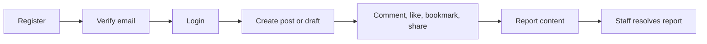
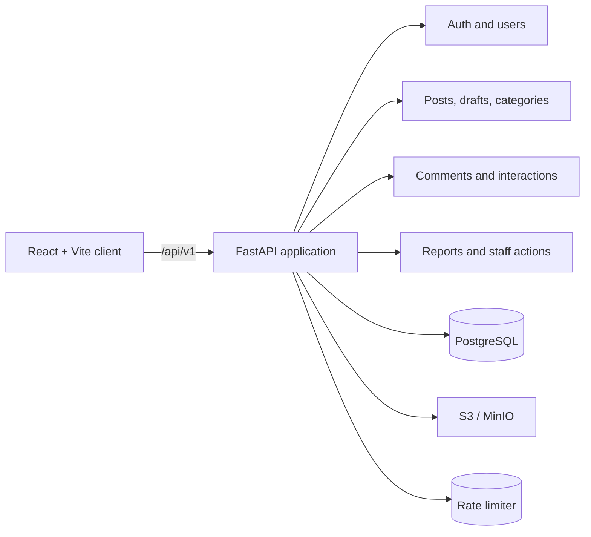

<div align="center">
  
  <h1>Simple Blog</h1>
  <p><a href="./README.md">🇬🇧 English</a> · <a href="./README.ru.md">🇷🇺 Русский</a></p>
  <p><strong>Self-hosted social publishing with a versioned API, PostgreSQL, and a React client.</strong></p>
  <p>Build a blog with posts, discussions, media, privacy controls, and staff moderation.</p>
  <p>
    <a href="https://github.com/Kene33/simple-blog/actions/workflows/backend.yml"></a>
    <a href="https://www.python.org/"></a>
    <a href="https://fastapi.tiangolo.com/"></a>
    <a href="https://react.dev/"></a>
    <a href="https://www.postgresql.org/"></a>
    <a href="./LICENSE"></a>
  </p>
  <p>
    <a href="#quick-start">Quick start</a> ·
    <a href="#features">Features</a> ·
    <a href="#api-first-flow">API flow</a> ·
    <a href="./docs/api-v1.md">API docs</a> ·
    <a href="./docs/architecture.md">Architecture</a> ·
    <a href="./CONTRIBUTING.md">Contributing</a>
  </p>
</div>

Simple Blog is a modular publishing application for teams that want to control
their content model and API contract. FastAPI serves the backend,
PostgreSQL stores relational state, MinIO provides local S3-compatible storage,
and the React client consumes `/api/v1`.

## Why Simple Blog

- **Social publishing primitives:** feeds, trending posts, categories, drafts,
  full-text search, comments, likes, bookmarks, and shares.
- **Account and privacy controls:** email verification, password reset, refresh
  sessions, profile/post/comment visibility, and HttpOnly cookies.
- **Staff moderation:** reports with target snapshots, category requests, user
  bans and mutes, role management, content hide/restore, and audit actions.
- **Operational safeguards:** CSRF protection, security headers, request IDs,
  structured errors, gzip responses, and rate limiting.
- **Provider-neutral media:** MIME and size validation with MinIO locally and
  S3-compatible storage.

## Quick start

### Start the backend

Requirements: Docker Desktop and Docker Compose v2.

```bash
git clone https://github.com/Kene33/simple-blog.git
cd simple-blog
docker compose up --build
```

Compose starts FastAPI, PostgreSQL 16, MinIO, and the Alembic migration job.
Development connection values live in `docker-compose.yml`.

Check the service:

```bash
curl http://localhost:8000/health/live
curl http://localhost:8000/health/ready
```

Open the API contract in [Swagger UI](http://localhost:8000/docs).

| Service | URL |
| --- | --- |
| API | <http://localhost:8000> |
| Swagger UI | <http://localhost:8000/docs> |
| MinIO API | <http://localhost:9000> |
| MinIO Console | <http://localhost:9001> |

### Start the React client

Open a second terminal:

```bash
cd src/frontend
npm ci
npm run dev
```

The Vite client runs at <http://localhost:5173> and proxies `/api` to the local
backend. Build the client with:

```bash
npm --prefix src/frontend run build
```

## API-first flow

The API uses `/api/v1`, JSON `snake_case`, UUID identifiers, UTC timestamps, and
`items` plus `next_cursor` for collection responses.



Create an account and store its cookies:

```bash
curl -i -c cookies.txt \
  -H 'Content-Type: application/json' \
  -d '{"username":"reader_01","email":"reader@example.com","password":"change-me-123"}' \
  http://localhost:8000/api/v1/auth/register
```

State-changing browser requests use the `X-CSRF-Token` header. The complete
request/response contract is documented in [REST API v1](./docs/api-v1.md) and
[API schemas](./docs/api-schemas.md).

## Features

| Area | Current capabilities |
| --- | --- |
| Auth | Register, email verification, login, refresh, logout, password reset |
| Profiles | Public/private visibility, profile fields, author comments |
| Content | Posts, drafts, categories, category requests, trending, search, pagination |
| Media | Image/video uploads, cover media, ownership checks, S3/MinIO storage |
| Discussion | Nested comments, edits, soft-delete tombstones, visibility controls |
| Interactions | Idempotent likes, bookmarks, copy/native share events |
| Moderation | Reports, staff queue, bans, mutes, roles, hide/restore, audit log |
| Client | React 19, Vite, JSX, fetch API layer, responsive CSS |

The app adds security headers, request IDs, structured logs, gzip compression,
rate limiting, and one error envelope for API failures. Media quotas and upload
limits are configurable in `src/core/config.py`.

## Architecture



Routers handle HTTP transport. Domain services enforce ownership, roles, and
business rules. PostgreSQL owns relational state; object storage owns media;
The rate limiter protects sensitive endpoints. The detailed boundaries live in
[architecture.md](./docs/architecture.md) and
[backend-module-boundaries.md](./docs/backend-module-boundaries.md).

More documentation:

- [Database schema](./docs/database-schema.md)
- [Error format](./docs/error-format.md)
- [Cursor pagination](./docs/pagination.md)
- [Roadmap](./docs/roadmap.md)

## Checks

Backend CI uses Python 3.12, PostgreSQL 16, the locked Python dependencies,
Alembic, Ruff, `pip-audit`, and pytest.

```bash
ruff check src tests
pytest -q tests
alembic upgrade head --sql
pip-audit -r requirements.lock
npm --prefix src/frontend run check:post-files
npm --prefix src/frontend run check:comment-tree
npm --prefix src/frontend run build
```

## Project structure

```text
src/
  api/       versioned FastAPI routers
  core/      config, security, rate limits, logging, errors
  db/        async sessions, models, migrations glue
  modules/   auth, users, posts, categories, media, comments,
             interactions, moderation
  frontend/  React/Vite client
docs/        API contracts and architecture notes
alembic/     PostgreSQL migrations
tests/       API, security, and PostgreSQL integration tests
```

## Contributing

Open an [issue](https://github.com/Kene33/simple-blog/issues) for a bug or idea.
Before a pull request:

1. Describe the problem and expected result.
2. Update API docs with contract changes.
3. Check ownership, CSRF, roles, visibility, and migrations.
4. Run the relevant backend and frontend checks.
5. List known limitations in the pull request.

Read the full rules in [CONTRIBUTING.md](./CONTRIBUTING.md).

## License

Simple Blog is released under the [MIT License](./LICENSE).
