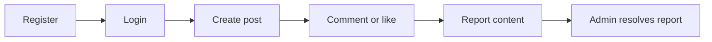
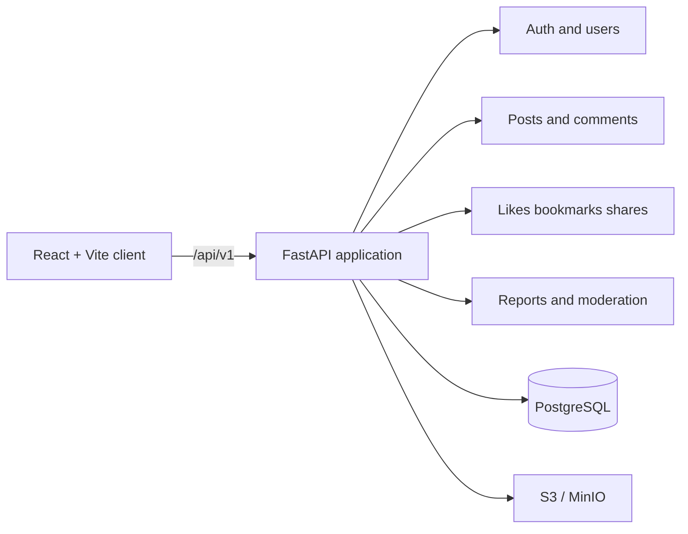

<div align="center">
  
  <h1>Simple Blog</h1>
  <p><a href="./README.md">🇬🇧 English</a> · <a href="./README.ru.md">🇷🇺 Русский</a></p>
  <p><strong>Self-hosted social publishing with a versioned API, real PostgreSQL data, and a React client.</strong></p>
  <p>Build a blog with posts, comments, media, and moderation on a contract you can inspect and extend.</p>
  <p>
    <a href="https://github.com/Kene33/simple-blog/actions/workflows/backend.yml"></a>
    <a href="https://www.python.org/"></a>
    <a href="https://fastapi.tiangolo.com/"></a>
    <a href="https://react.dev/"></a>
    <a href="https://www.postgresql.org/"></a>
    <a href="./LICENSE"></a>
  </p>
  <p>
    <a href="#quick-start">Quick start</a> ·
    <a href="#whats-included">Features</a> ·
    <a href="#api-first-flow">API flow</a> ·
    <a href="./docs/api-v1.md">API docs</a> ·
    <a href="./docs/architecture.md">Architecture</a> ·
    <a href="./CONTRIBUTING.md">Contributing</a>
  </p>
</div>

> Simple Blog gives you a practical base for a social publishing product. Start
> the API and PostgreSQL with one command, inspect the contract in Swagger, and
> shape the publishing rules around your product.

## Why Simple Blog

The project handles the work that turns a basic CRUD app into a social product:

- **Clear API boundaries.** FastAPI routers, domain services, and PostgreSQL
  models separate transport, use cases, and persistence.
- **A browser-safe session.** HttpOnly access and refresh cookies, a CSRF header,
  `user` and `admin` roles, a stable error envelope, and `X-Request-ID`.
- **Social workflows in the contract.** Feed, cursor pagination, comments,
  likes, bookmarks, shares, reports, and moderation.
- **Provider-neutral media.** Upload validation works with S3-compatible storage;
  local development uses MinIO.

## Quick start

### 1. Start the API and dependencies

You need Docker Desktop and Docker Compose v2.

```bash
git clone https://github.com/Kene33/simple-blog.git
cd simple-blog
docker compose up --build
```

Compose starts FastAPI, PostgreSQL, MinIO, and the migration job with the
 development defaults from `docker-compose.yml`. Replace `JWT_SECRET_KEY` and
other secrets before a public deployment.

Check the API:

```bash
curl http://localhost:8000/health/live
```

```json
{"status":"ok","service":"Simple Blog API","version":"0.1.0"}
```

Open the interactive contract in [Swagger UI](http://localhost:8000/docs).

| Service | URL |
| --- | --- |
| API | <http://localhost:8000> |
| Swagger UI | <http://localhost:8000/docs> |
| MinIO API | <http://localhost:9000> |
| MinIO Console | <http://localhost:9001> |

### 2. Start the React client

Open a second terminal:

```bash
cd src/frontend
npm install
npm run dev
```

The client runs at <http://localhost:5173>. Vite proxies `/api` to
`localhost:8000`, so cookies and the CSRF flow stay on one origin.

## API-first flow

Start with the health check, then explore the full contract in Swagger. Every
resource uses `/api/v1`; collection responses contain `items` and
`next_cursor`.



Registration creates a browser session and sets the cookies:

```bash
curl -i -c cookies.txt \\
  -H 'Content-Type: application/json' \\
  -d '{"username":"reader_01","email":"reader@example.com","password":"change-me-123"}' \\
  http://localhost:8000/api/v1/auth/register
```

The server returns a `csrf_token` cookie. Send its value in `X-CSRF-Token`
for state-changing requests. Find schemas and response details in
[REST API v1](./docs/api-v1.md) and [API schemas](./docs/api-schemas.md).

## What's included

| Area | Includes |
| --- | --- |
| Auth | Register, login, refresh, logout, HttpOnly cookies, CSRF, roles |
| Content | Posts, drafts, categories, tags, full-text search, cursor pagination |
| Media | MIME validation, image/video limits, S3-compatible storage |
| Discussion | Root comments, nested replies, edits, soft-delete tombstones |
| Interactions | Likes, bookmarks, copy/native shares |
| Moderation | Reports, admin queue, target snapshots, resolve/reject workflow |
| Client | React 19, Vite, JSX, vanilla CSS, `lucide-react`, fetch API layer |

## Architecture



FastAPI routers receive HTTP requests. Domain services enforce ownership, roles,
and business rules. PostgreSQL stores relationships and state; S3-compatible
storage accepts media. The client uses `fetch` and keeps access tokens out of
`localStorage`.

Read the detailed docs:

- [Architecture](./docs/architecture.md)
- [Backend module boundaries](./docs/backend-module-boundaries.md)
- [Database schema](./docs/database-schema.md)
- [Error format](./docs/error-format.md)
- [Pagination](./docs/pagination.md)
- [API v1](./docs/api-v1.md)

## Checks

Run these commands before opening a pull request:

```bash
ruff check src tests
pytest -q tests
alembic upgrade head --sql
npm --prefix src/frontend run build
```

GitHub Actions checks the backend with Python 3.12 and PostgreSQL 16. Vite
builds the frontend separately.

## Project structure

```text
src/
  api/       HTTP routers
  core/      config, security, logging, errors
  db/        async sessions, models, migration glue
  modules/   auth, users, posts, media, comments, interactions, moderation
  frontend/  React/Vite client
docs/        API contracts and architecture notes
alembic/     PostgreSQL migrations
tests/       API and PostgreSQL integration tests
```

## Contributing

Open an [issue](https://github.com/Kene33/simple-blog/issues) for a bug or idea.
Before opening a pull request:

1. Describe the problem and the expected result.
2. Update API docs with contract changes.
3. Check ownership, CSRF, roles, and migrations.
4. List the checks you ran and any known limitations.

Read the full rules in [CONTRIBUTING.md](./CONTRIBUTING.md).

## License

Simple Blog is released under the [MIT License](./LICENSE).
