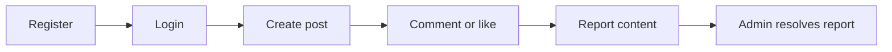
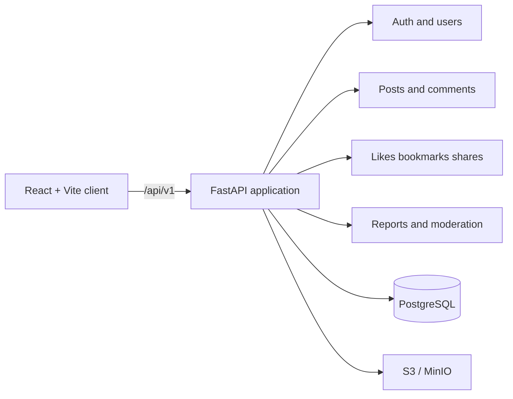

<div align="center">
  
  <h1>Simple Blog</h1>
  <p><strong>Self-hosted social publishing with a versioned API, real PostgreSQL data, and a React client.</strong></p>
  <p>Соберите блог с постами, комментариями, медиа и модерацией. Контракт API остаётся прозрачным и проверяемым.</p>
  <p>
    <a href="https://github.com/Kene33/simple-blog/actions/workflows/backend.yml"></a>
    <a href="https://www.python.org/"></a>
    <a href="https://fastapi.tiangolo.com/"></a>
    <a href="https://react.dev/"></a>
    <a href="https://www.postgresql.org/"></a>
    <a href="./LICENSE"></a>
  </p>
  <p>
    <a href="#быстрый-старт">Быстрый старт</a> ·
    <a href="#что-внутри">Возможности</a> ·
    <a href="#api-first-flow">API flow</a> ·
    <a href="./docs/api-v1.md">API docs</a> ·
    <a href="./docs/architecture.md">Architecture</a> ·
    <a href="./CONTRIBUTING.md">Contributing</a>
  </p>
</div>

> Simple Blog: рабочая база для social publishing продукта. Запустите API и
> PostgreSQL одной командой, откройте Swagger, подключите клиент и развивайте
> собственные правила публикации.

## Почему Simple Blog

Проект закрывает тот участок, где обычный CRUD быстро превращается в набор
разрозненных решений:

- **API с границами.** FastAPI routers, domain services и PostgreSQL-модели
  разделяют transport, use cases и хранение.
- **Безопасная browser-сессия.** HttpOnly access/refresh cookies, CSRF header,
  роли `user` и `admin`, стабильный error envelope и `X-Request-ID`.
- **Готовые социальные сценарии.** Feed, cursor pagination, comments,
  likes, bookmarks, shares, reports и moderation уже входят в контракт.
- **Медиа без привязки к провайдеру.** Upload-проверки работают с S3-compatible
  storage; локальная разработка использует MinIO.

## Быстрый старт

### 1. Поднимите API и зависимости

Нужны Docker Desktop и Docker Compose v2.

```bash
git clone https://github.com/Kene33/simple-blog.git
cd simple-blog
cp .env.example .env
docker compose up --build
```

Compose запускает FastAPI, PostgreSQL, MinIO и миграции. Для локального
запуска значения из `.env.example` подходят как development defaults. Перед
публичным deployment замените `JWT_SECRET_KEY` и остальные секреты.

Проверьте API:

```bash
curl http://localhost:8000/health/live
```

```json
{"status":"ok","service":"Simple Blog API","version":"0.1.0"}
```

Откройте интерактивный контракт в [Swagger UI](http://localhost:8000/docs).

| Service | URL |
| --- | --- |
| API | <http://localhost:8000> |
| Swagger UI | <http://localhost:8000/docs> |
| MinIO API | <http://localhost:9000> |
| MinIO Console | <http://localhost:9001> |

### 2. Запустите React-клиент

Откройте второй терминал:

```bash
cd src/frontend
npm install
npm run dev
```

Клиент откроется на <http://localhost:5173>. Vite проксирует `/api` на
`localhost:8000`, поэтому cookies и CSRF flow работают на одном origin.

## API-first flow

Начните с health check, затем изучите полный контракт в Swagger. Все ресурсы
используют `/api/v1`, а коллекции возвращают `items` и `next_cursor`.



Регистрация создаёт browser session и выставляет cookies:

```bash
curl -i -c cookies.txt \
  -H 'Content-Type: application/json' \
  -d '{"username":"reader_01","email":"reader@example.com","password":"change-me-123"}' \
  http://localhost:8000/api/v1/auth/register
```

После регистрации сервер возвращает `csrf_token` в cookie. Для изменяющих
запросов передайте его также в `X-CSRF-Token`. Схемы и все ответы описаны в
[REST API v1](./docs/api-v1.md) и [API schemas](./docs/api-schemas.md).

## Что внутри

| Area | Includes |
| --- | --- |
| Auth | Register, login, refresh, logout, HttpOnly cookies, CSRF, roles |
| Content | Posts, drafts, categories, tags, full-text search, cursor pagination |
| Media | MIME validation, image/video limits, S3-compatible storage |
| Discussion | Root comments, nested replies, edit, soft-delete tombstones |
| Interactions | Likes, bookmarks, copy/native shares |
| Moderation | Reports, admin queue, target snapshots, resolve/reject workflow |
| Client | React 19, Vite, JSX, vanilla CSS, `lucide-react`, fetch API layer |

## Архитектура



FastAPI routers принимают HTTP-запросы. Domain services проверяют ownership,
роли и бизнес-правила. PostgreSQL хранит связи и состояния, а S3-compatible
storage принимает медиа. Клиент получает данные через обычный `fetch` и не
хранит access tokens в `localStorage`.

Подробные документы:

- [Architecture](./docs/architecture.md)
- [Backend module boundaries](./docs/backend-module-boundaries.md)
- [Database schema](./docs/database-schema.md)
- [Error format](./docs/error-format.md)
- [Pagination](./docs/pagination.md)
- [Roadmap](./docs/roadmap.md)

## Проверки

Перед pull request запустите:

```bash
ruff check src tests
pytest -q tests
alembic upgrade head --sql
npm --prefix src/frontend run build
```

GitHub Actions проверяет backend в Python 3.12 и PostgreSQL 16. Frontend
собирается отдельно через Vite.

## Структура проекта

```text
src/
  api/       HTTP routers
  core/      config, security, logging, errors
  db/        async sessions, models, migrations glue
  modules/   auth, users, posts, media, comments, interactions, moderation
  frontend/  React/Vite client
docs/        API contracts and architecture notes
alembic/     PostgreSQL migrations
tests/       API and PostgreSQL integration tests
```

## Roadmap

- Поддерживать versioned API и тесты при изменениях клиента.
- Выпускать проверенные Docker images и deployment instructions.
- Стабилизировать frontend integration и добавить hosted demo.

Статус каждой задачи находится в [roadmap](./docs/roadmap.md). Документация
следует текущему API-контракту, а не старым legacy routes.

## Contributing

Откройте [issue](https://github.com/Kene33/simple-blog/issues) для ошибки или
идеи. Перед pull request:

1. Опишите проблему и ожидаемый результат.
2. Обновите API-документы вместе с изменением контракта.
3. Проверьте ownership, CSRF, роли и миграции.
4. Добавьте команды проверки и известные ограничения в описание PR.

Полные правила находятся в [CONTRIBUTING.md](./CONTRIBUTING.md).

## License

Simple Blog распространяется по [MIT License](./LICENSE).
