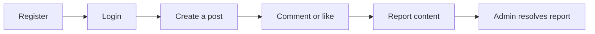
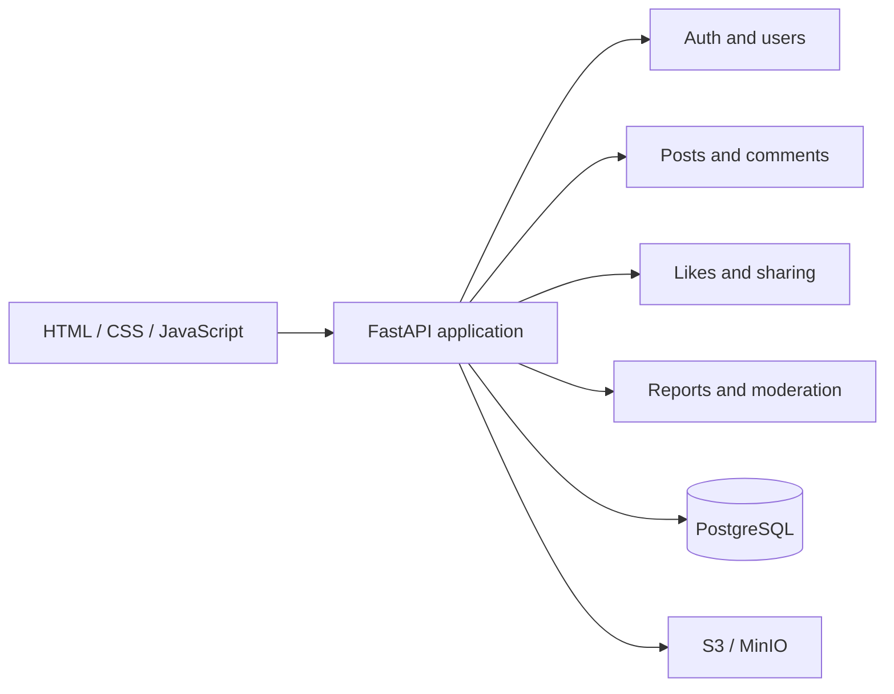

<div align="center">
  <h1>Simple Blog</h1>
  <p><strong>Модульный социальный блог на FastAPI, PostgreSQL и vanilla JavaScript.</strong></p>
  <p>A modular social blog built with FastAPI, PostgreSQL, and vanilla JavaScript.</p>
  <p>
    <a href="https://github.com/Kene33/simple-blog/actions/workflows/backend.yml"></a>
    <a href="https://www.python.org/"></a>
    <a href="https://fastapi.tiangolo.com/"></a>
    <a href="https://www.postgresql.org/"></a>
    <a href="./LICENSE"></a>
  </p>
  <p>
    <a href="#быстрый-запуск">Быстрый запуск</a> ·
    <a href="#сценарий-пользователя">Сценарий</a> ·
    <a href="#api">API</a> ·
    <a href="./docs/architecture.md">Архитектура</a> ·
    <a href="./CONTRIBUTING.md">Contributing</a> ·
    <a href="./docs/roadmap.md">Roadmap</a> ·
    <a href="https://github.com/Kene33/simple-blog/issues">Issues</a>
  </p>
</div>

Simple Blog gives developers a starting point for a social publishing service:
one FastAPI backend, a versioned REST API, PostgreSQL data, and S3-compatible
media storage for local development.

Проект подойдёт тем, кто собирает собственный блог, изучает модульный backend
или проверяет API-контракт на реальном PostgreSQL. Frontend-клиент развивается
отдельной дорожкой, поэтому README описывает стабильный backend-контракт и его
локальный запуск.

## Возможности / Features

- Регистрация, вход, refresh-сессии в HttpOnly cookies, CSRF и роли `user` / `admin`.
- Посты, профили, категории, теги, full-text search и cursor pagination.
- Медиа upload с проверкой MIME-типа и S3-compatible storage.
- Древовидные комментарии, soft-delete, tombstones, likes и share events.
- Жалобы и admin moderation через отдельные API-ресурсы.
- Structured errors и `X-Request-ID` для диагностики запросов.

## Быстрый запуск / Quick start

Нужны Docker и Docker Compose.

```bash
cp .env.example .env
docker compose up --build
```

После запуска:

| Сервис | Адрес |
| --- | --- |
| API | <http://localhost:8000> |
| OpenAPI / Swagger UI | <http://localhost:8000/docs> |
| MinIO API | <http://localhost:9000> |
| MinIO Console | <http://localhost:9001> |

Compose запускает FastAPI, PostgreSQL, MinIO и отдельный контейнер миграций.

Проверьте запуск health endpoint:

```bash
curl http://localhost:8000/health/live
```

Ожидаемый ответ:

```json
{"status":"ok","service":"Simple Blog API","version":"0.1.0"}
```

### Локальный запуск без Docker

Установите Python 3.12, PostgreSQL и MinIO. Укажите подключения в `.env`, затем:

```bash
pip install -r requirements.txt
alembic upgrade head
uvicorn src.main:app --reload --port 4000
```

В локальном режиме API использует <http://localhost:4000>, а MinIO слушает
<http://localhost:9000>.

## Сценарий пользователя / User flow

API поддерживает базовый цикл публикации и модерации:



Пример маршрута:

1. Зарегистрируйте пользователя через `POST /api/v1/auth/register`.
2. Войдите через `POST /api/v1/auth/login`, после чего сервер установит cookies.
3. Создайте пост через `POST /api/v1/posts` с CSRF header.
4. Добавьте комментарий через `POST /api/v1/posts/{post_id}/comments`.
5. Отправьте жалобу через `POST /api/v1/reports`, а администратор обработает её через `/api/v1/admin/reports`.

## Дальше / Next steps

- [Roadmap](./docs/roadmap.md) показывает текущие backend и frontend направления.
- [Contributing](./CONTRIBUTING.md) описывает локальные проверки и формат изменений.
- [Issues](https://github.com/Kene33/simple-blog/issues) принимает ошибки и предложения.

Текущий backend даёт проверяемый preview через Swagger и health endpoint.

## API

Все ресурсы используют базовый путь `/api/v1`. Полный контракт, параметры,
коды ответов и схемы находятся в [REST API v1](./docs/api-v1.md) и
[API schemas](./docs/api-schemas.md).

| Группа | Основные ресурсы |
| --- | --- |
| Auth и users | `/auth/*`, `/users/*` |
| Posts | `/posts` |
| Media | `/media/*` |
| Comments | `/posts/{post_id}/comments`, `/comments/*` |
| Interactions | likes, shares, bookmarks |
| Moderation | `/reports`, `/admin/reports/*` |

Состояние браузера хранится в cookies. Для изменяющих запросов клиент передаёт
CSRF header. Коллекции возвращают `items` и `next_cursor`.

## Архитектура / Architecture



The application runs as a modular monolith. HTTP routers handle transport,
domain services handle use cases and authorization, PostgreSQL stores
relational state, and S3-compatible storage keeps uploaded media.

Подробности:

- [Архитектура backend](./docs/architecture.md)
- [Границы модулей](./docs/backend-module-boundaries.md)
- [Схема базы данных](./docs/database-schema.md)
- [Формат ошибок](./docs/error-format.md)
- [Cursor pagination](./docs/pagination.md)

## Проверки / Checks

```bash
ruff check src tests
pytest -q tests
alembic upgrade head --sql
```

GitHub Actions запускает эти проверки в Python 3.12 с PostgreSQL 16.

## Структура / Structure

```text
src/
  api/       HTTP routers
  core/      configuration, security, logging, errors
  db/        async sessions and SQLAlchemy models
  modules/   domain services
  frontend/  HTML, CSS and JavaScript
docs/        architecture and API contracts
alembic/     PostgreSQL migrations
tests/       API and PostgreSQL integration tests
```

## License

Simple Blog распространяется по лицензии [MIT](./LICENSE).
