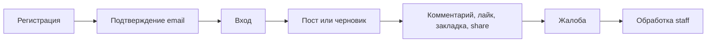
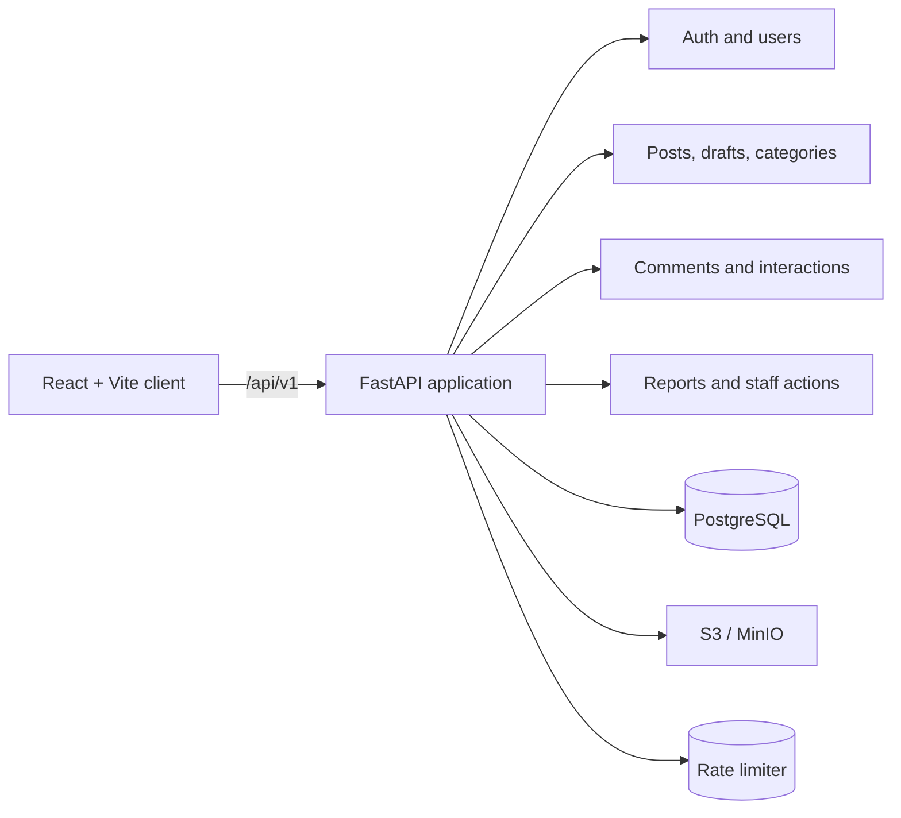

<div align="center">
  
  <h1>Simple Blog</h1>
  <p><a href="./README.md">🇬🇧 English</a> · <a href="./README.ru.md">🇷🇺 Русский</a></p>
  <p><strong>Самостоятельно размещаемый социальный блог с версионируемым API, PostgreSQL и React-клиентом.</strong></p>
  <p>Публикации, обсуждения, медиа, настройки приватности и модерация в одном проекте.</p>
  <p>
    <a href="https://github.com/Kene33/simple-blog/actions/workflows/backend.yml"></a>
    <a href="https://www.python.org/"></a>
    <a href="https://fastapi.tiangolo.com/"></a>
    <a href="https://react.dev/"></a>
    <a href="https://www.postgresql.org/"></a>
    <a href="./LICENSE"></a>
  </p>
  <p>
    <a href="#быстрый-старт">Быстрый старт</a> ·
    <a href="#возможности">Возможности</a> ·
    <a href="#api-first-flow">API flow</a> ·
    <a href="./docs/api-v1.md">API docs</a> ·
    <a href="./docs/architecture.md">Архитектура</a> ·
    <a href="./CONTRIBUTING.md">Contributing</a>
  </p>
</div>

Simple Blog — модульное приложение для публикаций. FastAPI обслуживает backend,
PostgreSQL хранит связанные данные, MinIO даёт S3-compatible storage для локальной
разработки, а React-клиент работает с API `/api/v1`.

## Почему Simple Blog

- **Социальные сценарии:** лента, тренды, категории, черновики, полнотекстовый
  поиск, комментарии, лайки, закладки и sharing.
- **Аккаунты и приватность:** подтверждение email, восстановление пароля,
  refresh-сессии, видимость профиля, постов и комментариев, HttpOnly cookies.
- **Модерация:** жалобы с snapshots, заявки на категории, блокировки и mute
  пользователей, роли, скрытие и восстановление контента, audit actions.
- **Эксплуатационная безопасность:** CSRF, security headers, request IDs,
  structured errors, gzip и rate limiting.
- **Медиа без привязки к провайдеру:** проверка MIME и размеров, MinIO локально,
  S3-compatible storage.

## Быстрый старт

### Backend

Нужны Docker Desktop и Docker Compose v2.

```bash
git clone https://github.com/Kene33/simple-blog.git
cd simple-blog
docker compose up --build
```

Compose запускает FastAPI, PostgreSQL 16, MinIO и отдельный контейнер с Alembic
миграциями. Development-параметры находятся в `docker-compose.yml`.

Проверьте сервисы:

```bash
curl http://localhost:8000/health/live
curl http://localhost:8000/health/ready
```

Контракт API доступен в [Swagger UI](http://localhost:8000/docs).

| Сервис | URL |
| --- | --- |
| API | <http://localhost:8000> |
| Swagger UI | <http://localhost:8000/docs> |
| MinIO API | <http://localhost:9000> |
| MinIO Console | <http://localhost:9001> |

### React-клиент

Откройте второй терминал:

```bash
cd src/frontend
npm ci
npm run dev
```

Vite запустит клиент на <http://localhost:5173> и направит `/api` на локальный
backend. Собрать клиент можно командой:

```bash
npm --prefix src/frontend run build
```

## API-first flow

API использует базовый путь `/api/v1`, JSON в `snake_case`, UUID, UTC timestamps и
`items` с `next_cursor` для коллекций.



Зарегистрируйте пользователя и сохраните cookies:

```bash
curl -i -c cookies.txt \
  -H 'Content-Type: application/json' \
  -d '{"username":"reader_01","email":"reader@example.com","password":"change-me-123"}' \
  http://localhost:8000/api/v1/auth/register
```

Изменяющие запросы браузера используют header `X-CSRF-Token`. Полный контракт
запросов и ответов описан в [REST API v1](./docs/api-v1.md) и
[API schemas](./docs/api-schemas.md).

## Возможности

| Область | Актуальные возможности |
| --- | --- |
| Auth | Регистрация, подтверждение email, вход, refresh, logout, password reset |
| Профили | Публичная и приватная видимость, поля профиля, комментарии автора |
| Контент | Посты, черновики, категории, заявки категорий, тренды, поиск, pagination |
| Медиа | Изображения, видео, cover media, ownership checks, S3/MinIO |
| Обсуждения | Вложенные комментарии, редактирование, soft-delete tombstones, visibility |
| Interactions | Идемпотентные likes, bookmarks, copy/native shares |
| Moderation | Жалобы, staff queue, bans, mutes, роли, hide/restore, audit log |
| Клиент | React 19, Vite, JSX, fetch API layer, responsive CSS |

Приложение добавляет security headers, request IDs, structured logs, gzip,
rate limiting и единый error envelope. Квоты и лимиты медиа находятся в
`src/core/config.py`.

## Архитектура



Routers отвечают за HTTP transport. Domain services проверяют ownership, роли и
бизнес-правила. PostgreSQL хранит состояние, object storage — медиа, rate limiter
защищает чувствительные endpoints.

Подробности:

- [Архитектура](./docs/architecture.md)
- [Границы backend-модулей](./docs/backend-module-boundaries.md)
- [Схема базы данных](./docs/database-schema.md)
- [Формат ошибок](./docs/error-format.md)
- [Cursor pagination](./docs/pagination.md)

## Проверки

CI использует Python 3.12, PostgreSQL 16, locked dependencies, Alembic, Ruff,
`pip-audit` и pytest.

```bash
ruff check src tests
pytest -q tests
alembic upgrade head --sql
pip-audit -r requirements.lock
npm --prefix src/frontend run check:post-files
npm --prefix src/frontend run check:comment-tree
npm --prefix src/frontend run build
```

## Структура проекта

```text
src/
  api/       FastAPI routers
  core/      config, security, rate limits, logging, errors
  db/        async sessions, models, migrations glue
  modules/   auth, users, posts, categories, media, comments,
             interactions, moderation
  frontend/  React/Vite client
docs/        API contracts and architecture notes
alembic/     PostgreSQL migrations
tests/       API, security и PostgreSQL integration tests
```

## Contributing

Откройте [issue](https://github.com/Kene33/simple-blog/issues) для ошибки или
идеи. Перед pull request:

1. Опишите проблему и ожидаемый результат.
2. Обновите API-документы вместе с изменением контракта.
3. Проверьте ownership, CSRF, роли, visibility и миграции.
4. Запустите подходящие backend и frontend checks.
5. Укажите известные ограничения в описании PR.

Полные правила находятся в [CONTRIBUTING.md](./CONTRIBUTING.md).

## Лицензия

Simple Blog распространяется по [MIT License](./LICENSE).
