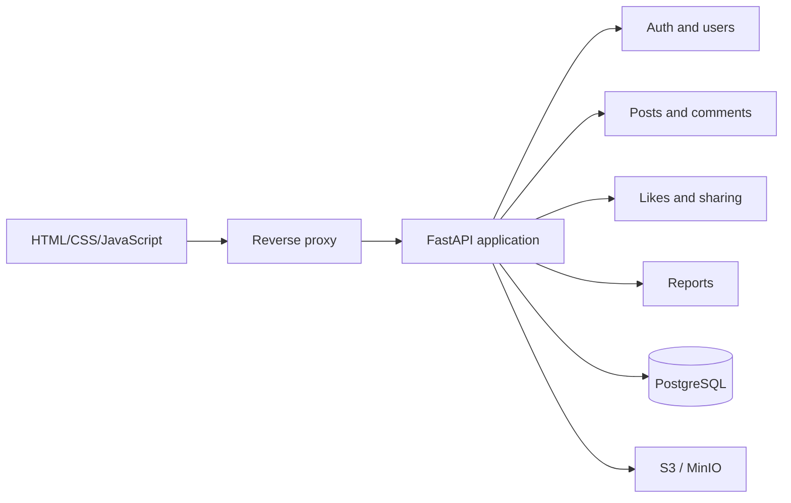
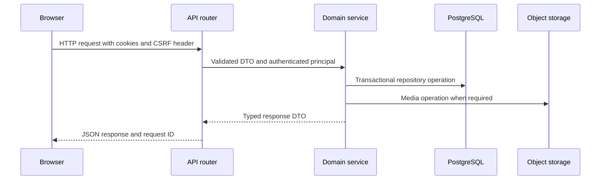

# Simple Blog backend architecture

## Target system

Simple Blog uses a modular monolith. One FastAPI service owns the HTTP API and
frontend delivery, PostgreSQL owns relational state, and S3-compatible storage
owns uploaded media.

The service runs as one deployable unit while its domain modules keep data
ownership and dependency direction explicit. The design leaves room to extract
media processing or search later if runtime evidence justifies that cost.

## Request flow

Routers handle transport concerns. Services handle use cases, authorization,
and transaction boundaries. Repositories handle persistence. The full layering
and ownership policy lives in [`backend-module-boundaries.md`](backend-module-boundaries.md).

## Main data flows

### Authentication

1. The client sends registration or login credentials over HTTPS.
2. The auth service hashes or verifies the password with Argon2id.
3. The service creates a short-lived access JWT and a rotated refresh session.
4. The server sets both tokens in Secure HttpOnly cookies.
5. Other modules receive the authenticated principal from the auth dependency;
   they do not accept ownership IDs from request bodies.

### Post creation

1. The client uploads media and receives media metadata and IDs.
2. The post service validates title, content, tags, and media ownership.
3. One database transaction creates the post and its tag/media relations.
4. The response returns a transport DTO with author, media, and counters.

### Feed and search

1. The router validates filters and an opaque cursor.
2. The post service applies the filter fingerprint and deterministic ordering.
3. PostgreSQL returns a bounded page using `(created_at, id)` keyset pagination.
4. The response includes `items` and `next_cursor`.

### Comments and interactions

Comments use `parent_id` for unlimited nesting and load one level at a time.
Likes use a unique user/post pair. Sharing records an event with an optional
user ID so anonymous link copies can be counted without creating an account.

## Components

| Component | Responsibility | State |
| --- | --- | --- |
| FastAPI app | HTTP transport, auth dependencies, OpenAPI | Stateless between requests |
| Auth/users modules | Credentials, sessions, profiles, roles | PostgreSQL |
| Posts module | Posts, tags, feed, search projection | PostgreSQL |
| Comments module | Comment tree and soft deletion | PostgreSQL |
| Media module | Validation, object keys, attachment lifecycle | PostgreSQL + S3 |
| Interactions module | Likes, shares, counters | PostgreSQL |
| Moderation module | Reports and admin queue | PostgreSQL |
| Frontend | Browser state, rendering, user interactions | Browser cookies/storage |

## Cross-cutting behavior

- Every response receives an `X-Request-ID` and structured log context.
- Errors use one stable envelope with machine-readable codes.
- State-changing browser requests require CSRF validation.
- Resource ownership comes from the authenticated principal.
- Lists use cursor pagination; clients do not calculate offsets.
- Soft-deleted posts and comments preserve referential integrity.
- Media limits and MIME validation run before object storage writes finish.

See the focused contracts:

- [Backend module boundaries](backend-module-boundaries.md)
- [PostgreSQL data model](database-schema.md)
- [REST API v1](api-v1.md)
- [API schemas](api-schemas.md)
- [Error format](error-format.md)
- [Cursor pagination](pagination.md)

## Deployment shape

Development uses Docker Compose with FastAPI, PostgreSQL, and MinIO. Production
can replace MinIO with an S3-compatible provider and place a reverse proxy in
front of FastAPI. The first release does not require Redis, a queue, or a
separate search service.

The service must expose liveness and readiness checks. Alembic migrations run as
an explicit deployment step before the application accepts traffic.

## Decisions and tradeoffs

| Decision | Reason | Deferred alternative |
| --- | --- | --- |
| Modular monolith | Keeps deployment and local development simple | Split services after measured pressure |
| PostgreSQL | Gives constraints, transactions, and full-text search | Managed PostgreSQL provider |
| S3-compatible media | Separates large files from relational state | CDN and direct browser uploads |
| HttpOnly cookie tokens | Fits the browser client and avoids localStorage tokens | Server sessions or bearer tokens |
| Cursor pagination | Stable feed traversal without offset drift | Offset pagination for admin-only reports |
| Versioned REST API | Lets frontend and backend evolve against a named contract | Additional API versions later |

## Current repository boundary

The existing `src/api`, `src/database`, and `src/schemas` packages are legacy
code and are not imported by the new `app` runtime. The new runtime uses only
PostgreSQL through SQLAlchemy and Alembic; the old SQLite files are not read or
updated.
