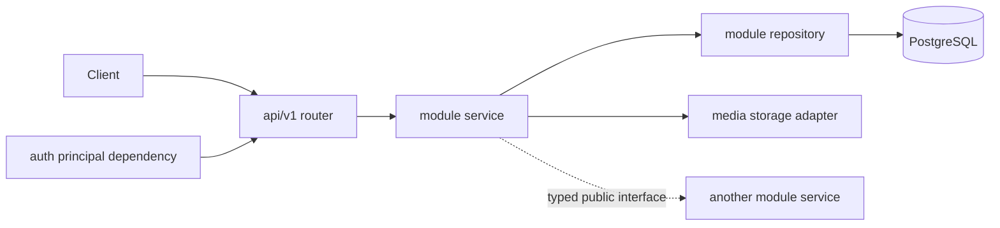

# Backend module boundaries

## Purpose

The target backend is a modular FastAPI monolith. It is deployed as one service,
uses one PostgreSQL database, and keeps domain responsibilities separate so the
application can grow without becoming a set of coupled route handlers.

This document defines module ownership only. The database ER model, REST
endpoints, error format, and pagination contract are intentionally defined in
the following roadmap tasks.

## Layering

```text
HTTP routers -> application services -> repositories -> database/storage
                     |
                     +-> domain policies and authorization checks
```

- **Routers** translate HTTP requests into service calls and return Pydantic
  response schemas. They contain no business rules or SQL.
- **Services** own use cases, transaction boundaries, authorization decisions,
  and interactions between modules.
- **Repositories** own persistence queries for one module. They do not expose
  FastAPI or HTTP types.
- **Core** and **db** are shared technical layers; they cannot depend on a
  domain module.

## Target package structure

```text
src/
  main.py
  api/v1/
  core/
  db/
  modules/
    auth/
    users/
    posts/
    comments/
    messaging/
    media/
    interactions/
    moderation/
```

`api/v1` assembles routers from domain modules. A domain module may expose its
router, schemas, service, repository, and models, but it must not reach into
another module's repository directly.

## Module ownership

| Module | Owns | May depend on |
| --- | --- | --- |
| `core` | configuration, logging, error types, security primitives, request context | standard libraries and shared packages only |
| `db` | engine, async session lifecycle, migrations bootstrap, transaction helper | `core` |
| `auth` | registration credentials, password verification, access/refresh token lifecycle, session revocation and CSRF policy | `core`, `db`, public user lookup service |
| `users` | profile data, public profile projection, avatar reference, roles | `core`, `db`, public media lookup service |
| `posts` | post lifecycle, author ownership, category, tags, feed/query projections | `core`, `db`, public media attachment service |
| `comments` | comment lifecycle, parent-child validation, comment ownership | `core`, `db`, public post existence service |
| `media` | upload validation, object-storage keys, metadata, orphan cleanup, attachment ownership checks | `core`, `db`, storage adapter |
| `interactions` | likes, share events, interaction counters/read state | `core`, `db`, public post existence service |
| `moderation` | reports, report status, admin-only moderation actions | `core`, `db`, public post/comment lookup services |
| `messaging` | direct conversations, memberships, messages, read state | `core`, `db`, auth principal, users policy |

## Dependency rules

1. A router calls only its own module's service.
2. A service accesses its own repository directly. Cross-module work is done
   through a small public service interface, never another module's repository.
3. Database models are private implementation details outside the module that
   owns them; cross-module calls exchange IDs and typed DTOs.
4. `media` owns storage lifecycle. `posts` and `users` can attach media only by
   calling the media attachment interface, which verifies the authenticated
   owner.
5. `auth` determines the authenticated principal. Other modules receive that
   principal from a shared dependency and must never trust an author ID from an
   HTTP request body or query parameter.
6. `moderation` records and resolves reports. Content deletion or hiding stays
   in the content-owning module, invoked through an explicit service method.
7. There are no imports from `api/v1` into modules, from repositories into
   routers, or from `core`/`db` into modules.

## Runtime flow



## Migration from the current codebase

The legacy SQLite implementation was removed after the B1 and B2 foundation
tasks. New features belong only in the `src` runtime and must use the
PostgreSQL persistence layer.

## Non-goals for this boundary

- Splitting the application into microservices.
- Defining PostgreSQL columns or migrations.
- Defining the public REST endpoint list.
- Adding recommendation systems or notifications.
