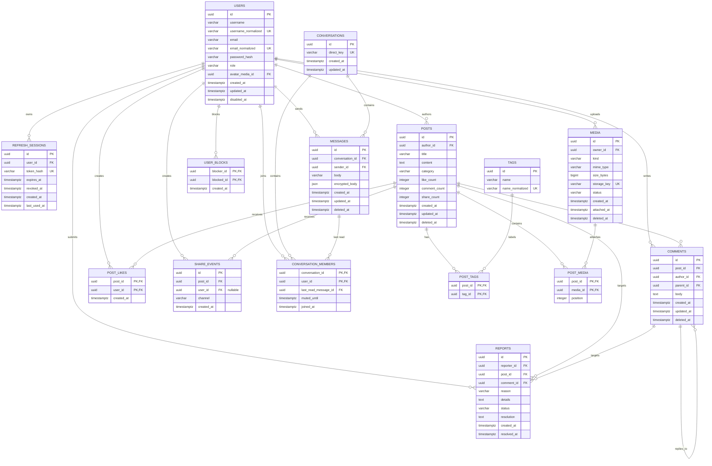

# PostgreSQL data model

## Scope

This is the target relational model for the public MVP. The application uses
UUID identifiers, UTC timestamps, soft deletion for user-visible content, and
database constraints for invariants that do not depend on a request context.

## Entity relationship diagram

## Ownership and constraints

- `users.username_normalized` and `users.email_normalized` are unique. The
  original display values may preserve user casing.
- `refresh_sessions.token_hash` is unique. Raw refresh tokens are never stored.
- `posts.author_id`, `comments.author_id`, and `media.owner_id` are the source
  of ownership checks; client-provided usernames or user IDs are not trusted.
- `post_tags` prevents duplicate tag assignment through its composite key.
- `post_media` uses `position` for deterministic rendering. The service layer
  enforces at most four files per post and at most one video.
- `comments.parent_id` is nullable and self-referencing. The service layer
  verifies that a parent belongs to the same post.
- `post_likes` has one row per user/post pair, making like and unlike naturally
  idempotent.
- `share_events.user_id` is nullable so anonymous copy/native shares can be
  counted without storing an account identity.
- `reports` has exactly one target: either `post_id` or `comment_id`. A check
  constraint enforces this invariant.
- Content uses `deleted_at` so a deleted post or comment can remain referenced
  by replies, reports, and interaction history.
- `conversations.direct_key` uniquely identifies one direct conversation for a
  pair of users. Membership is the access boundary for messages and read state.
- `messages.encrypted_body` stores the opaque E2EE envelope. `messages.body` is
  retained only as a bounded legacy placeholder for the database constraint;
  plaintext is never returned by the API. Deleted messages retain a tombstone.
- `user_blocks` has a composite primary key and rejects self-blocks. The
  messaging policy treats a block in either direction as a generic not-found
  response to avoid disclosing relationship state.

## Indexes

- `posts (created_at DESC, id DESC)` for deterministic feed pagination.
- `posts (author_id, created_at DESC, id DESC)` for profile feeds.
- `posts (category, created_at DESC, id DESC)` for category filtering.
- `post_tags (tag_id, post_id)` and `tags (name_normalized)` for tag search.
- `comments (post_id, parent_id, created_at, id)` for threaded pagination.
- `comments (author_id, created_at DESC)` for ownership/history views.
- `media (owner_id, status, created_at)` for upload cleanup.
- `reports (status, created_at)` for the moderation queue.
- PostgreSQL full-text index over post title and content will be added with the
  search migration in B5.

## Transaction boundaries

- Registration creates the user and initial auth state in one transaction.
- Post creation and tag association are one transaction. Media must already be
  uploaded and owned by the user before association.
- Like/unlike relies on the unique composite key and runs in one transaction.
- Comment creation validates the parent and inserts the comment in one
  transaction.
- Counter updates are transactionally coupled to the corresponding write or
  can be rebuilt from source rows if a repair job is needed.

## Migration notes

The existing `users.db` and `posts.db` schemas are not compatible with this
model: they have no stable user primary key, store passwords unsafely, and use
different post ownership columns. The MVP starts with a clean Alembic schema;
the old SQLite files are not part of the new runtime path.
